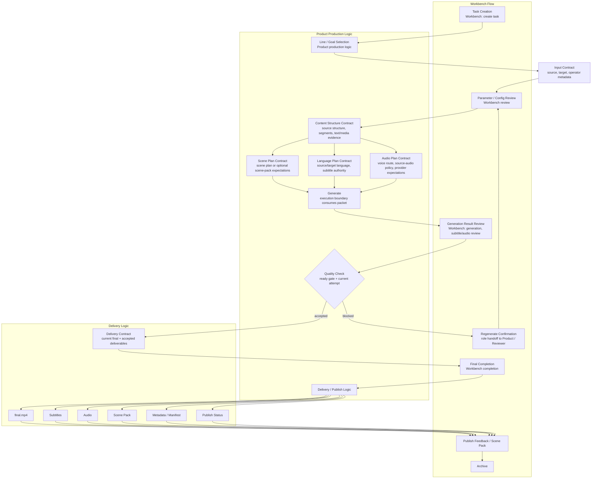

# ApolloVeo 2.0 Top-Level Business Flow v1

Date: 2026-04-25
Status: P2 pre-execution baseline; product-facing and role-readable

## Purpose

本文件定义 ApolloVeo 2.0 的顶层业务流。它用于让 Product、Architect、Designer、Backend/Platform、Implementer、Reviewer 对齐同一条工厂生产链。

它不启动 P2 implementation，不引入新 UI，不吸收 donor code，不改变 Hot Follow runtime。

## What The Factory Produces

ApolloVeo 2.0 factory 生产的是一组可交付的内容产物，而不是一个 studio shell：

- `final.mp4`
- subtitles
- audio
- scene pack
- metadata / manifest
- publish status
- archive record

这些产物必须从 factory packet 和 delivery contract 推导，不能从 workbench surface 或 donor product shape 反推。

## Top-Level Mermaid Flow

## Stage / Contract Object Mapping

| Stage | Product logic | Workbench flow | Delivery logic | Contract objects consumed |
| --- | --- | --- | --- | --- |
| task creation | production request starts | create task | none | input contract draft |
| line / goal selection | select line, goal, target result | operator chooses line/goal | none | input contract |
| parameter/config review | confirm legal business parameters | review source, language, audio, scene options | none | input, language plan, audio plan |
| content structure | define content structure | inspect source understanding | none | content structure contract |
| scene plan | define scene/shot expectations | inspect/adjust plan where legal | scene-pack expectation only | scene plan contract |
| audio plan | define route and audio expectations | review voice/provider/source-audio policy | audio deliverable expectation | audio plan contract |
| language plan | define subtitle authority and language route | review subtitles/helper diagnostics | subtitle deliverable expectation | language plan contract |
| generate | execute through boundary | generation progress | no accepted delivery yet | full packet, worker/capability boundary |
| subtitle/audio review | check current subtitles/audio | subtitle/audio review | candidate deliverables only | language plan, audio plan, artifact facts |
| quality check | ready gate decides accepted/current | pass/block/regenerate | delivery readiness derived | delivery contract, ready gate, current attempt |
| final completion | accepted result | final completion | current final exists | delivery contract |
| publish feedback / scene pack | publish decision and optional derivatives | feedback, scene pack visibility | publish status / scene pack | delivery contract |
| archive | retain final record | archive visible | archive manifest | delivery contract, metadata/manifest |

## Role Handoff Map

| Handoff point | From | To | Evidence required |
| --- | --- | --- | --- |
| line / goal selected | Product | Architect | line goal and input contract scope |
| packet shape ready | Architect | Designer, Backend/Platform | packet envelope and contract-object mapping |
| surface flow ready | Designer | Backend/Platform | workbench stage map tied to contract objects |
| boundary plan ready | Backend/Platform | Implementer | gate checklist says implementation may start |
| implementation slice ready | Implementer | Reviewer | tests, behavior declaration, evidence links |
| delivery accepted | Reviewer | Product | ready-gate and delivery contract evidence |

## How Each Role Should Read This Diagram

Product:

- Read the left-to-right chain as the production promise: goal selection becomes content structure, scene/audio/language plans, generation, QA, delivery, publish, archive.
- Product owns intent and acceptance criteria, not runtime truth writes.

Architect:

- Read every stage as a contract/boundary question: which object is consumed, which layer owns truth, where handoff occurs.
- Architect blocks implementation when a stage lacks packet, surface, or gate evidence.

Designer:

- Read the Workbench Flow subgraph as the surface sequence: task creation, config review, generation, subtitle/audio review, regenerate confirmation, final completion, publish feedback, archive.
- Designer may shape role-readable surfaces, but cannot create alternate readiness truth.

Backend/Platform:

- Read Generate, Quality Check, and Delivery as boundary-consumption points.
- Backend/Platform designs packet validation, worker/capability routing, response contracts, and delivery truth paths only after gates are explicit.

Implementer:

- Read the diagram as a dependency map, not an implementation ticket list.
- No implementation begins until the gate checklist allows a scoped P2 slice.

Reviewer:

- Read the diagram as the merge-control baseline.
- Any PR that skips packet contracts, invents surface truth, absorbs donor code, or reopens Hot Follow behavior should be blocked.

## Relation To Hot Follow

Hot Follow remains the reference line for current-vs-historical final, ready-gate discipline, helper side-channel discipline, and workbench/publish truth alignment.

This top-level flow is above Hot Follow. It must not be used to reopen Hot Follow feature behavior.

## Relation To Donor Material

Donor material may inform planning structures, candidate/linked asset flows, provider/model governance, and asset usage indexing.

Donor material must not define ApolloVeo 2.0 top-level product shell, task truth, delivery truth, or runtime status writes.
