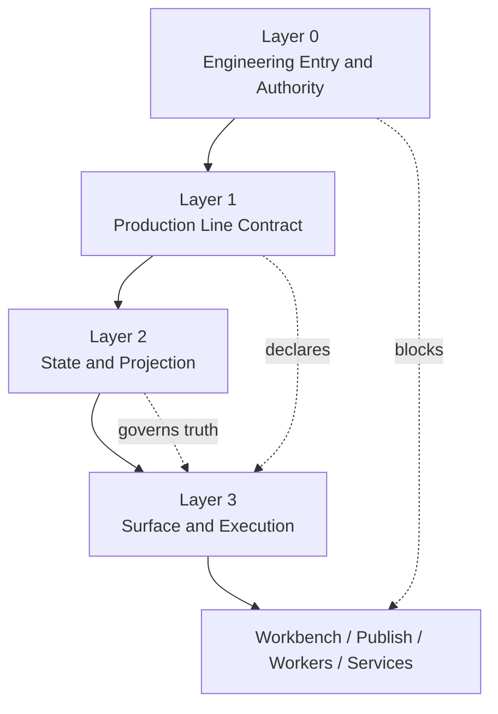

# Factory Four-Layer Architecture Baseline v1

Date: 2026-04-23
Status: Rules-first baseline

## Purpose

This document freezes the factory architecture layers that future scenario or
line work must obey.

It exists to stop ApolloVeo from falling back into task/router/service
condition-chain growth before the rules are explicit.

## Layer 0 — Engineering Entry & Authority Layer

Layer 0 controls how engineering work is allowed to begin.

It owns:

- reading contract
- engineering indexes
- execution sequence
- phase control
- baseline execution logs

Its job is to define what must be read, which branch or phase is authoritative,
and what scope is blocked.

It does not own runtime business logic.

## Layer 1 — Production Line Contract Layer

Layer 1 defines what a production line is.

It owns:

- line contract
- SOP profile
- skills bundle reference
- worker profile reference
- deliverable profile reference
- asset sink profile reference
- input contract reference

Its job is to declare the runtime parts that a line is assembled from.

It does not execute the line directly and does not own task-instance truth.

## Layer 2 — State & Projection Layer

Layer 2 defines business-state truth and the rules that interpret it.

It owns:

- four-layer state model
- ready gate
- projection rules
- blocking vs non-blocking logic
- truth precedence

Its job is to determine how artifact facts, current-attempt state, and
presentation-safe outputs relate to each other.

It does not own HTTP routing, worker orchestration shells, or UI implementation.

## Layer 3 — Surface & Execution Layer

Layer 3 is where runtime surfaces and execution components live.

It includes:

- routers
- services
- workbench
- publish
- workers

It may consume Layer 1 and Layer 2.

It may not invent or own higher-order business rules that belong in contracts,
ready-gate rules, or state precedence baselines.

## Belongs Here / Must Not Live Here

| Layer | Belongs here | Must not live here |
| --- | --- | --- |
| Layer 0 | reading contract, index docs, phase-control decisions, execution gating | router-local business rules, scenario runtime branches |
| Layer 1 | line refs, profile refs, contract composition, runtime assembly metadata | task-instance status mutation, publish/workbench fallback truth |
| Layer 2 | state precedence, ready gate, blocking logic, current-vs-historical interpretation, projection rules | auth checks, HTTP parsing, worker process management |
| Layer 3 | auth, request parsing, service dispatch, worker execution, response shaping | ad hoc line policy, duplicate readiness rules, surface-owned business truth |

## Mermaid Diagram

## Interaction Rules

1. Layer 0 decides what work is allowed to start.
2. Layer 1 decides what parts a line is assembled from.
3. Layer 2 decides how state truth is interpreted and projected.
4. Layer 3 may consume Layer 1 and Layer 2 but may not redefine them.
5. If Layer 3 needs a new business rule, the rule must move upward into Layer 1
   or Layer 2 before implementation grows.

## Why Routing / Business / State / Presentation Must Stay Separate

- Routing is transport.
- Business rules are contract/state rules.
- State interpretation is not the same as artifact existence.
- Presentation is not truth.

When these are mixed, publish/workbench drift and giant router/service files are
the predictable result.

## How This Reduces Silicon-Parallel Drift

- It gives every future change a fixed question: is this entry authority,
  contract assembly, state/projection truth, or runtime surface behavior?
- It blocks surface-layer code from silently becoming the rule owner.
- It makes later scenario discussion possible without treating rough scenarios
  as runtime contracts before the rules exist.
