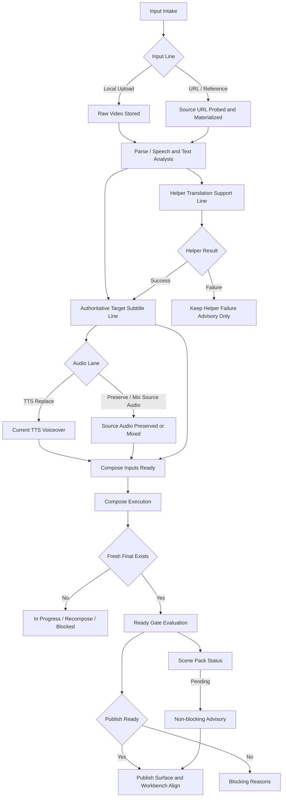

# Hot Follow Business Flow v1

Date: 2026-04-22

## Purpose

This document makes the current Hot Follow business flow explicit so publish,
workbench, ready-gate, and future contract editors stop relying on scattered
router/service `if/else` logic.

Hot Follow remains the current baseline production line. This document does not
start new-line implementation.

## Flow Summary

Hot Follow has two input lines, two audio lanes, and two subtitle/translation
tracks that converge into one compose and publish-ready path.

- Input lines:
  - local upload
  - URL/reference
- Audio lines:
  - BGM/source-audio-preserved or mixed lane
  - pure voiceover replacement lane
- Subtitle/translation lines:
  - authoritative target subtitle line
  - helper translation / helper-only support line

Current business rule:

- the authoritative target subtitle line controls subtitle truth
- helper translation may assist or fail, but it does not become persisted
  business truth
- final current output plus current-attempt readiness dominates publish
  presentation truth
- scene-pack pending is operationally useful but non-blocking once the final is
  fresh and publishable

## Mermaid Flow

## Business Paths

### Input Intake

- Local upload creates raw artifact truth directly in repo/storage.
- URL/reference creates probe/runtime evidence first, then the same downstream
  parse/subtitle/audio/compose path applies.

### Subtitle Truth

- The authoritative target subtitle line is the only subtitle line that may
  satisfy publish/workbench subtitle truth.
- Helper translation is support input and advisory evidence only.
- Helper failure may explain why the target subtitle line is not ready, but it
  must not overwrite valid target subtitle truth once that truth exists.

### Audio Truth

- TTS replacement lane requires current voiceover truth.
- Preserve/mix lane may remain publishable without TTS when the route contract
  explicitly allows `preserve_source_route`, `bgm_only_route`, or
  `no_tts_compose_route`.
- Audio route selection is a contract decision, not a surface decision.

### Compose And Final

- Compose execution produces the current final deliverable.
- A historical final may exist physically, but only the current fresh final may
  satisfy final-ready publish truth.
- Current attempt and final freshness must be evaluated together.

### Publish-Ready

- Publish and workbench must consume the same L2/L3-derived truth path.
- Scene-pack pending remains visible but non-blocking once the current final is
  ready and the ready gate says publishable.

## Current Attempt vs Last Successful Final

- `current_attempt` answers whether the current subtitle/audio/compose path is
  ready, stale, blocked, or requires redub/recompose.
- `last_successful_final` records the last known successful deliverable output.
- Publish presentation must prefer current fresh final truth over stale
  historical deliverables.

## Four-Layer Mapping

| Business step | L1 field(s) | L2 field(s) | L3 field(s) | L4 field(s) | Source of truth |
| --- | --- | --- | --- | --- | --- |
| Input intake | `status`, `last_step`, `parse_status` | `raw_path`, source probe artifacts | input resolution in current task runtime | operator summary input guidance | repo row plus storage/probe facts |
| Parse / speech analysis | `parse_status` | parse artifacts, extracted text artifacts | parse-source selection for current run | presentation parse status | parse runtime outputs |
| Authoritative target subtitle line | `subtitles_status` | target subtitle artifact existence | `target_subtitle_current`, source selection, helper-failure relevance | `subtitle_ready`, subtitle advisory | subtitle lane service plus artifact truth |
| Helper translation support line | helper step status only | helper artifacts if any | helper failure state and relevance | advisory only | helper translation runtime |
| Audio lane selection | `dub_status` | voiceover artifact, source-audio preserved facts, BGM facts | selected compose route, `audio_ready`, `dub_current` | `audio_ready` explanation in ready gate | voice state and artifact facts |
| Compose input readiness | `compose_status` | compose-input artifacts, final artifact existence | `compose_input_ready`, `compose_execute_allowed`, stale/fresh determination | compose blocking reasons | artifact facts plus current attempt |
| Compose execution | `compose_status`, pipeline compose node | final artifact existence | `compose_reason`, `requires_recompose` | pipeline/workbench/publish compose presentation | compose runtime plus current final truth |
| Publish-ready | none directly; consumes prior layers | current final exists, subtitle/audio/current artifacts | current attempt ready state | `ready_gate.publish_ready`, operator summary, publish/workbench presentation | ready-gate engine on L2/L3 inputs |
| Scene-pack follow-up | `scenes_status` / `scenes_pack_status` | scenes artifact facts | none required for final readiness | advisory / pending note only | scene-pack artifact truth |

## How This Reduces Silicon-Parallel Drift

- It makes the same business chain visible to router, presenter, and contract
  work, so teams stop reconstructing the line mentally from different partial
  code paths.
- It marks helper translation, scene pack, and historical final as
  non-authoritative for final-ready truth, which reduces competing local
  interpretations.
- It gives future contract-editor work concrete objects to manipulate instead of
  reverse-engineering runtime conditionals.
