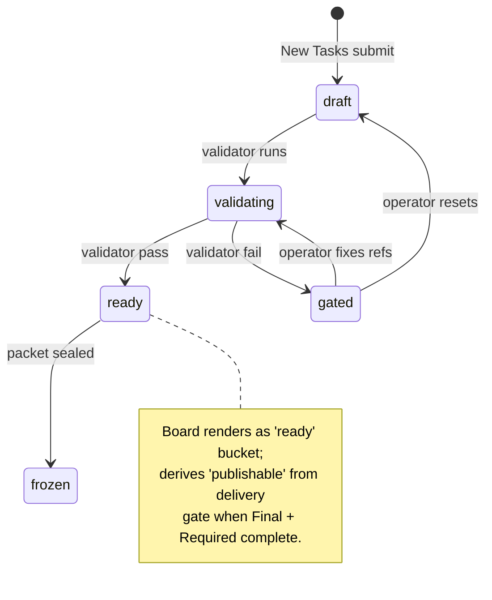

# Surface 1 — Board & New Tasks (Low-fi v1)

> Extends the Task Area surface with the explicit Board / New Tasks split required by `ApolloVeo_Operator_Visible_Surfaces_v1.md` §5.1 + §5.2. The Task Area projection rules below remain authoritative.

## Page Goal

- **Board**: operator overview and dispatch — see every live task, filter by line, see which are blocked / ready / publishable, route into Workbench or Delivery.
- **New Tasks**: line-first creation — pick a line, fill the line-specific intake fields, post a packet, route to the right next surface.

Both pages are **read-mostly with respect to truth**: state buckets, gate badges, and validator output are always projections of L2 / L3 / derived gates, never authored by the page.

## Original Purpose (preserved)

The operator's entry surface. Pick or intake a packet, see whether it has cleared the gate, and route to the Workbench. The Task Area is **read-mostly** with respect to gate truth — it never authors a `ready_state`, it only renders one.

## Layout (low-fi)

```
┌─────────────────────────────────────────────────────────────────────────┐
│  TASK AREA                                              [+ New Packet]  │
├─────────────────────────────────────────────────────────────────────────┤
│  Filter: [ Line ▾ ] [ Gate State ▾ ] [ Search ____________ ]            │
├─────────────────────────────────────────────────────────────────────────┤
│  ┌── Packet Card ──────────────────────────────────────────────────┐    │
│  │  Line: matrix_script         packet_version: v1                 │    │
│  │  Gate: ● ready               Reference: hot_follow ✓            │    │
│  │  Capabilities: understanding · variation · subtitles · …        │    │
│  │  Generic refs: 6/6   Line-specific refs: 2/2                    │    │
│  │  [ Open in Workbench ]   [ View validator report ]              │    │
│  └─────────────────────────────────────────────────────────────────┘    │
│  ┌── Packet Card ──────────────────────────────────────────────────┐    │
│  │  Line: digital_anchor        packet_version: v1                 │    │
│  │  Gate: ◐ validating          Reference: hot_follow ✓            │    │
│  │  Capabilities: avatar · speaker · subtitles · dub · …           │    │
│  │  [ Open (read-only) ]   [ View validator report ]               │    │
│  └─────────────────────────────────────────────────────────────────┘    │
└─────────────────────────────────────────────────────────────────────────┘
```

## Regions

| Region | Role | Notes |
|---|---|---|
| Header | New-packet intake | Launches a contract-shaped intake form scoped to envelope-required fields only. |
| Filters | Index narrowing | `Line` filter values are the literal `line_id` constants from the packet schemas. `Gate State` filter values are the five `ready_state` enum values. No invented buckets. |
| Packet Card list | Per-packet projection | One card per packet. Card content is a strict projection of envelope fields. |

## Packet Card — fields and bindings

| Field rendered | Source (contract path) | Notes |
|---|---|---|
| Line label | `line_id` | Display literal value; no relabeling. |
| `packet_version` | `packet_version` | Show as text. |
| Gate badge | `evidence.ready_state` | Five-state badge: `draft`, `validating`, `ready`, `gated`, `frozen`. No "in progress", "running", "done". |
| Reference badge | `evidence.reference_line` + `evidence.reference_evidence_path` | Always shows `hot_follow`. Green check iff `reference_evidence_path` resolves to a present file (truth from validator, not surface). |
| Capability chips | `binding.capability_plan[].kind` | Render each `kind` as a chip. `mode` shown on hover. `required: false` chips render with a dotted border. |
| Generic refs counter | `generic_refs.length` | Format `n/6` (envelope `minItems: 6`). |
| Line-specific refs counter | `line_specific_refs.length` | Format `n/2` (envelope `minItems: 2`). |

## Open routing

- `[ Open in Workbench ]` only enabled when `evidence.ready_state ∈ {ready, frozen}`.
- All other `ready_state` values render `[ Open (read-only) ]`, which routes to Workbench in inspect mode (no execution affordance).
- `[ View validator report ]` opens `evidence.validator_report_path` in a side drawer.

## State the Task Area must NOT invent

- No "draft saved", "submitted", "in queue", "running", "completed".
- No vendor / model / provider / engine selectors at intake.
- No donor or supply UI. The intake form has no concept of capability sourcing.
- No "publishable" / "delivery_ready" / "final_ready" — these are explicitly forbidden by the envelope's metadata `not` clause.

## Contract Mapping Notes

| UI element | Contract object | Contract path |
|---|---|---|
| Line filter | `line_id` const | packet.schema.json `properties.line_id.const` |
| Gate badge | `ready_state` enum | packet.schema.json `$defs.evidence.properties.ready_state.enum` |
| Reference badge | `reference_line` const | packet.schema.json `$defs.evidence.properties.reference_line.const` |
| Capability chips | `capability_plan[].kind` | packet.schema.json `$defs.capabilityEntry.properties.kind.enum` |
| Generic refs counter | `generic_refs` array | packet.schema.json `properties.generic_refs.minItems` |
| Line-specific refs counter | `line_specific_refs` array | packet.schema.json `properties.line_specific_refs.minItems` |
| Validator report link | `validator_report_path` | packet.schema.json `$defs.evidence.properties.validator_report_path` |

**Gate Truth Rule**: The Task Area never writes `ready_state`. The badge is a one-way projection of validator output.

---

## Board — state-bucket layout (extension)

Adds an explicit state-overview strip and blocked-reason chip on top of the existing packet-card list. Buckets are derived from `evidence.ready_state` plus the validator output already linked from each card; the surface does not invent new states.

```
┌─────────────────────────────────────────────────────────────────────────┐
│  BOARD                                              [+ New Task]        │
├─────────────────────────────────────────────────────────────────────────┤
│  Line: [ All ▾ Hot Follow · Matrix Script · Digital Anchor ]            │
│  State Overview:  blocked  3  │  ready  5  │  publishable  2           │
├─────────────────────────────────────────────────────────────────────────┤
│  ▼ blocked (3)                                                          │
│   ┌── Packet Card  matrix_script v1                              ─┐     │
│   │  Gate: ✕ gated   Blocker: line_specific_refs missing (1/2)    │     │
│   │  [ View validator report ]                                    │     │
│   └───────────────────────────────────────────────────────────────┘     │
│  ▼ ready (5)                                                            │
│   ┌── Packet Card  digital_anchor v1                             ─┐     │
│   │  Gate: ● ready   Caps: avatar · speaker · subtitles · dub ·…  │     │
│   │  [ Open in Workbench ]                                        │     │
│   └───────────────────────────────────────────────────────────────┘     │
│  ▼ publishable (2)                                                      │
│   ┌── Packet Card  hot_follow v1                                  ─┐    │
│   │  Final video ✓  · Required deliverables ✓  · Manifest ✓       │     │
│   │  [ Open in Delivery ]   [ Open in Workbench ]                 │     │
│   └───────────────────────────────────────────────────────────────┘     │
└─────────────────────────────────────────────────────────────────────────┘
```

### Bucket derivation

| Bucket | Predicate (read-only projection) |
|---|---|
| `blocked` | `evidence.ready_state ∈ {draft, validating, gated}` |
| `ready` | `evidence.ready_state == ready` and no `publishable` projection set |
| `publishable` | derived publish gate = true (Final Video present + Required Deliverables resolved per `factory_delivery_contract`). Never UI-local. |

Buckets are presentation grouping only — the underlying truth is `evidence.ready_state` and the derived publish gate. The Board does not author the publish gate; it consumes whatever projection the gateway already exposes for the packet.

### Blocker chip

The `Blocker:` chip on `gated` cards is a literal restatement of the validator's primary failing rule. Source: `evidence.validator_report_path` head reason. The Board never composes its own blocker text.

---

## New Tasks page (extension)

Line-first creation flow. The page does **not** offer a "generic task" path — every task starts from a line.

```
┌─────────────────────────────────────────────────────────────────────────┐
│  NEW TASK                                                                │
├─────────────────────────────────────────────────────────────────────────┤
│  Step 1 — Choose line                                                    │
│    ( ) Hot Follow      ( ) Matrix Script      ( ) Digital Anchor         │
├─────────────────────────────────────────────────────────────────────────┤
│  Step 2 — Line-specific intake fields                                    │
│  (rendered per Operator_Visible_Surfaces_v1 §5.2; see table below)       │
├─────────────────────────────────────────────────────────────────────────┤
│  Step 3 — Envelope completeness check (read-only)                        │
│    generic_refs:        ▢▢▢▢▢▢   (0/6)                                   │
│    line_specific_refs:  ▢▢       (0/2)                                   │
├─────────────────────────────────────────────────────────────────────────┤
│  [ Cancel ]                                  [ Submit task ]             │
└─────────────────────────────────────────────────────────────────────────┘
```

### Step 2 — line-specific intake fields

Fields are taken verbatim from `ApolloVeo_Operator_Visible_Surfaces_v1.md` §5.2 and map onto `factory_input_contract` and `line_specific_refs[]`. The form **never** offers vendor / model / provider / engine choices and **never** asks the operator to pick a worker.

| Line | Fields rendered | Contract destination |
|---|---|---|
| Hot Follow | `reference_url` or `reference_video`, `target_language`, subtitle/dub strategy hint, helper-translation entry | `factory_input_contract` + `line_specific_refs[ref_id=hot_follow_subtitle_authority]` (subtitle authority hint) |
| Matrix Script | `goal`, `audience`, `topic`, `script_text`, `target_language`, `reference_assets[]`, `forbidden_rules[]` | `factory_input_contract` + `line_specific_refs[ref_id=matrix_script_variation_matrix]` (axis seeds) + `…slot_pack` |
| Digital Anchor | `script` / `copy`, `role_profile_ref`, `scene_binding_hint`, `speaker` / `language` initial preference | `factory_input_contract` + `line_specific_refs[ref_id=digital_anchor_role_pack]` + `…speaker_plan` |

### Step 3 — completeness check

Pure projection of envelope minimums (`generic_refs.minItems = 6`, `line_specific_refs.minItems = 2`). The page never invents a "draft saved" or "submitted" state.

### Post-submit routing

| Line | Routing on successful submit |
|---|---|
| Hot Follow | Direct to Workbench (intake produces a directly-runnable packet — line goal is fast turnaround). |
| Matrix Script | Land on Board card; transition to Workbench when validator clears the packet to `ready`. |
| Digital Anchor | Land on Board card; transition to Workbench when validator clears the packet to `ready`. |

The page does not implement the routing decision itself — it follows whatever the gateway returns as the next-surface hint on the packet's evidence object.

---

## State transitions (Mermaid)



All transitions are owned by the validator + line factory. The Board renders the resulting `ready_state`; the New Tasks page only triggers the initial `draft → validating` transition.

---

## Page Goal · Low-fi Layout · Contract Mapping · Notes / Known Deferrals

### Page Goal
Board: triage and dispatch. New Tasks: line-first creation. Both surfaces read truth, never write it.

### Low-fi Layout
- **Board**: header + line filter + state overview strip + bucketed packet-card list (`blocked` / `ready` / `publishable`). Existing per-card layout in §"Layout (low-fi)" above remains canonical.
- **New Tasks**: three-step form (line select → line-specific intake → completeness check) with envelope counters.

### Contract Mapping (consolidated)

| Element | Contract path |
|---|---|
| Task list (Board cards) | packet envelope projection — `line_id`, `packet_version`, `evidence.ready_state`, `binding.capability_plan[]`, `generic_refs[]`, `line_specific_refs[]` |
| Line filter | `line_id` const (Hot Follow / Matrix Script / Digital Anchor) |
| State buckets | `evidence.ready_state` enum + derived publish gate (read-only projection) |
| Blocker chip | head reason from `evidence.validator_report_path` |
| Line packet (creation) | `factory_input_contract` + `line_specific_refs[]` for the chosen line |
| Authoritative state source | gateway packet envelope only — Board never composes its own state |
| Post-create routing | gateway-returned next-surface hint |

### Notes / Known Deferrals
- **Publishable bucket** assumes the gateway exposes a derived publish gate; if not yet wired, render the bucket empty rather than computing it locally.
- **Blocker chip wording**: render validator output verbatim. Wording polish is design-deferred until validator messages stabilize.
- **New Tasks pre-population from Asset**: deferred to B-roll → New Tasks handoff (see B-roll low-fi).
- **Bulk actions** on Board cards (multi-select retire / re-validate): deferred — not in §5.1 scope.

