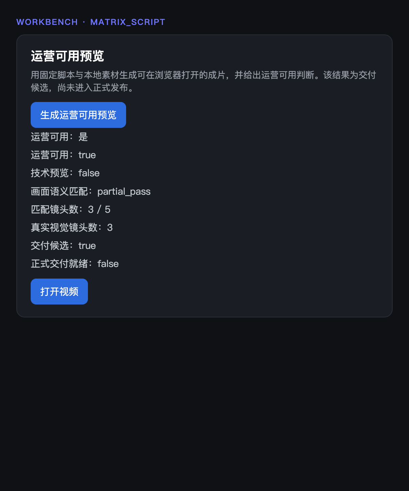
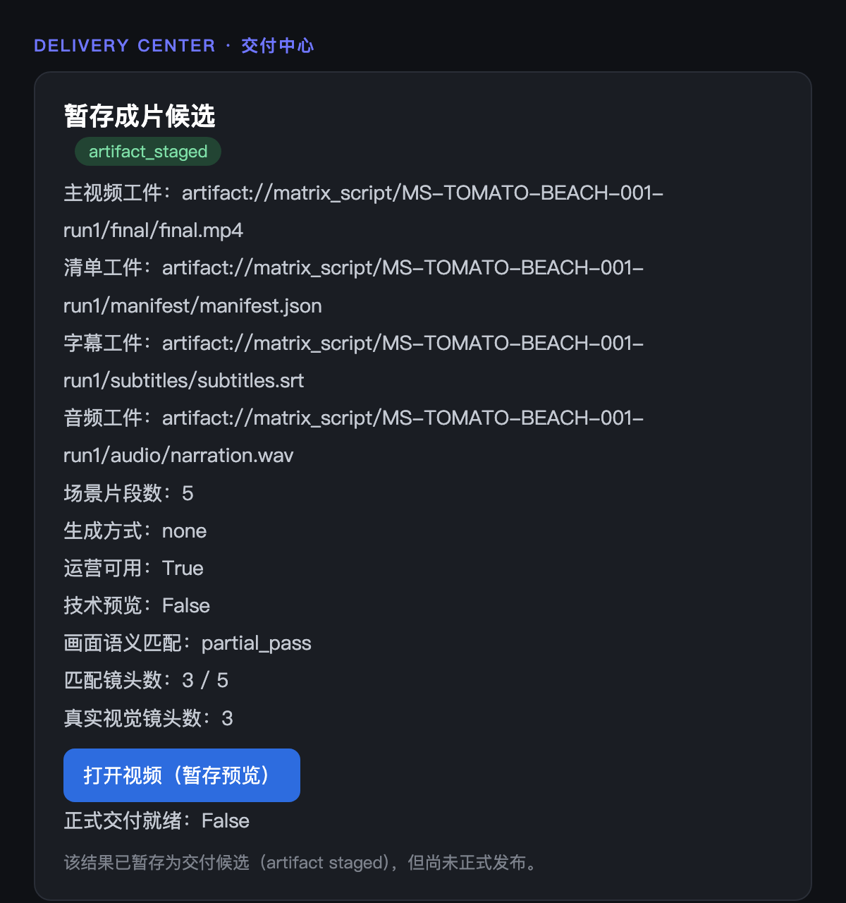

# PR-A Review Addendum — UI / Page Rendered Evidence + Boundary + Governance

PR: [#187](https://github.com/zhaojfifa/apolloveo-auto/pull/187) · Branch: `phase3/pr-a-matrix-script-tomato-real-result` · Commit base: `origin/main` @ `3ecff9e0`

This addendum responds to the PR-A conditional-approval verdict. The screenshots below are rendered
from the **exact shipped template markup** (Workbench `task_workbench.html` lines 625–702; Delivery
`task_publish_hub.html` lines 374–411) with the **real run data** from task `MS-TOMATO-BEACH-001-run1`.
The Workbench shot is the action's own JavaScript rendering the actual route JSON response (the same
payload the live `POST /api/matrix-script/{id}/tomato-real-result` returned). No markup was hand-authored
for the evidence.

---

## 1. Workbench rendered evidence

Visible in the Workbench "运营可用预览" action (`data-role="matrix-script-tomato-real-result-action"`):

| Required field | Rendered |
|---|---|
| operator_usable | 运营可用：true ✅ |
| technical_preview | 技术预览：false ✅ |
| visual_semantic_match | 画面语义匹配：partial_pass ✅ |
| shot_match_count | 匹配镜头数：3 / 5 ✅ |
| real_visual_count | 真实视觉镜头数：3 ✅ |
| preview link | 打开视频 (href = `/api/matrix-script/MS-TOMATO-BEACH-001-run1/tomato-real-result/preview/final.mp4`) ✅ |
| official_publish_ready=false | 正式交付就绪：false ✅ |

(Also visible: 交付候选：true.)

## 2. Delivery rendered evidence

Visible in the Delivery "暂存成片候选" block (`data-role="matrix-script-dc-staged-candidate"`):

| Required field | Rendered |
|---|---|
| staged preview candidate | 暂存成片候选 + `artifact_staged` pill ✅ |
| preview link | 打开视频（暂存预览） ✅ |
| delivery_candidate=true | (acceptance) 运营可用：True / 交付候选 via `data-delivery-candidate="True"` ✅ |
| official_publish_ready=false | 正式交付就绪：False ✅ |
| no publish_url / publish_status | confirmed absent (token scan = none) ✅ |

(Also visible: the L3 acceptance fields 技术预览：False / 画面语义匹配：partial_pass / 匹配镜头数：3 / 5 / 真实视觉镜头数：3.)

## 3. Boundary evidence

`git diff --stat origin/main..HEAD` touches only: the 3 asset PNGs, two execution-log docs, `gateway/app/main.py` (+2 registration lines), the new route, four new `matrix_script` services, one new test file, and the two `matrix_script` template branches.

- no provider_url: ✅ — payload forbidden-token scan returns none (`akool / provider_url / temporary_url / download_url / publish_url / publish_status / model_id / credit / http:// / https://`).
- no Akool task id / model_id / credit: ✅ — `generation_provider="none"`; no provider/vendor identifiers anywhere.
- no schema / contract change: ✅ — `git diff --name-only origin/main..HEAD | grep -iE "schema|/contracts/|packet"` → none.
- no Hot Follow / Digital Anchor change: ✅ — `… | grep -iE "hot_follow|digital_anchor"` → none.
- artifact_storage.py untouched: ✅ — `… | grep artifact_storage` → none; the new path reuses the existing `upload_artifact` / `get_download_url` abstraction only via the injected sink.

## 4. Governance note — PR-186 baseline merge status

- **PR-186** (`docs(matrix-script): add real result baseline 20260601`) is **OPEN / unmerged**. It touches exactly one file: `docs/execution/MATRIX_SCRIPT_REAL_RESULT_BASELINE_20260601.md`.
- **PR-A** was branched from `origin/main` @ `3ecff9e0` (which does NOT contain the baseline doc). PR-A's file set is **disjoint** from PR-186's single file — there is no overlap and no merge conflict.
- **Conclusion: PR-A is safe to review and merge independently of PR-186.** PR-A has no code or test dependency on the baseline document (the baseline is the governance/cognitive anchor for the work, not a build dependency; its constraints are already satisfied and evidenced in this PR). The two PRs may merge in either order; **no rebase is required**. Recommended for the governance record: merge PR-186 as well (either before or after PR-A) so the baseline anchor is on `main`.

## 5. Tests / green status (unchanged from PR body)

- new suite `test_matrix_script_tomato_real_result.py` → 16 passed; adjacent real-trial regression → 31 passed total.
- `py_compile` on changed Python files → OK; `git diff --check` → clean; both edited templates parse under Jinja.
- Interpreter `.venv` Python 3.13.5; ffmpeg 8.1.1 (captions composited via Pillow `overlay` — this build lacks `drawtext`/`subtitles`).
